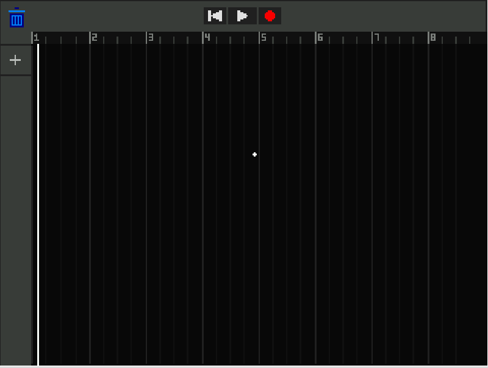
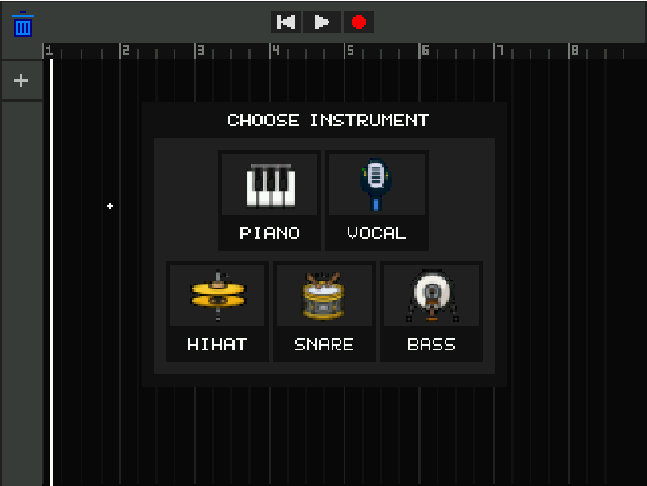
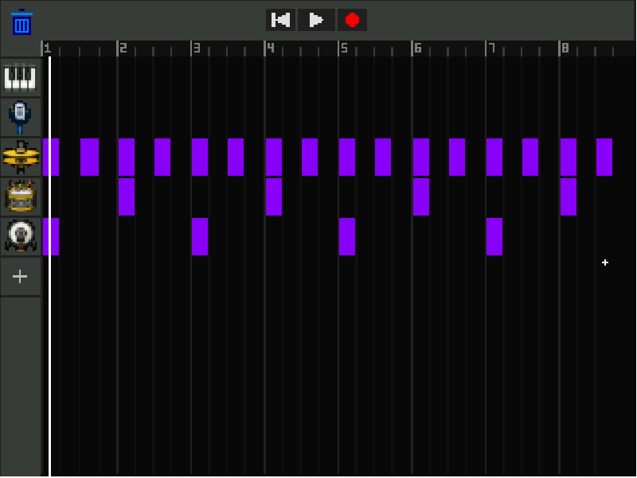
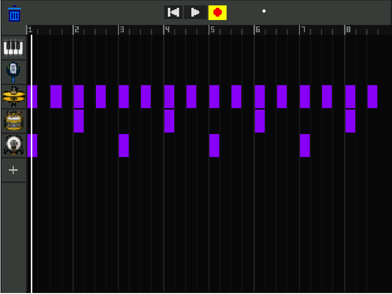
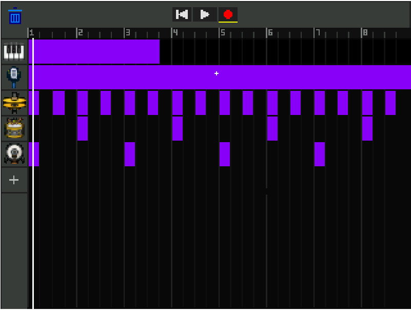
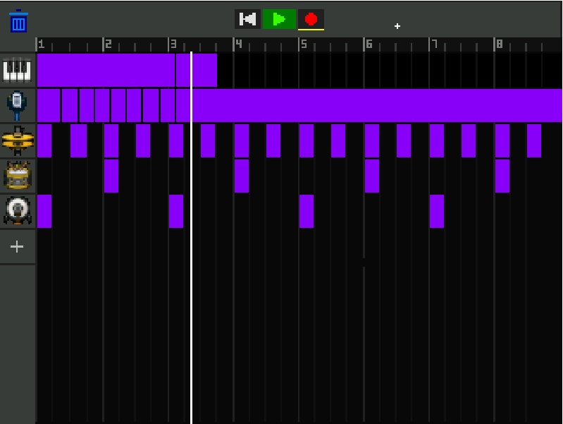
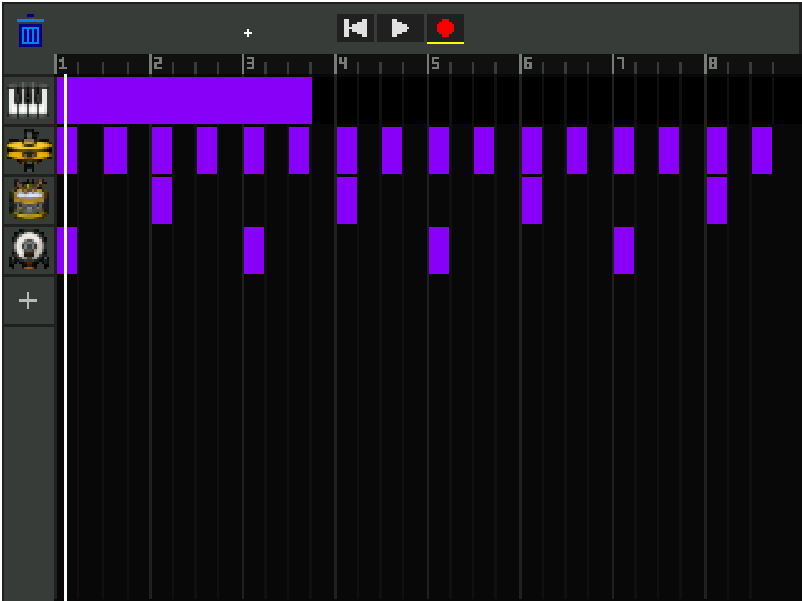

# ECE243_project

1.0 Project Description

Our project called FPGArageBand is an interactive music producing tool that allows users to create custom drum beats as well as record vocals and piano. At its core, it runs three distinct engines in parallel: input polling, graphical rendering, and real time audio processing. The system continuously polls PS/2 peripherals to handle mouse driven UI interactions like toggling grid notes, managing playback, and selecting instruments alongside keyboard and push button inputs for live piano synthesis and octave shifting. In the background, a real-time audio engine reads preloaded drum sample arrays, dynamically synthesizes piano waveforms, or records live microphone inputs into dedicated memory buffers. This audio engine mixes overlapping voices and drum samples to ensure sample tails are not cut off abruptly, and pushes the final mixed stream to the audio codec. Simultaneously, the graphics engine manages a double buffered VGA display, synchronizing the visual playhead, UI sprites, and recording progress bars with the audio output to prevent screen tearing.

2.0 Instructions for Operation

	The program opens on the main screen of the audio workstation, consisting of various buttons for user interaction and grid lines that indicate the measures (or bars) of the music to be played. The graphical user interface (GUI) includes the following buttons: play, skip to start, record, add instrument, and remove instrument. A cursor is drawn at the center of the screen on startup, erasing and redrawing on the screen as the user moves their mouse to different positions (Figure 1).

    Figure 1. Default Main Screen of FPGArageBand     
               
    Figure 2. Choose Instrument Menu

Clicking on the plus sign in the left panel opens up the choose instrument screen. Five instruments are included: piano, bass drum, snare drum, hi hat and vocals. Clicking on any of these icons using the cursor will add the corresponding instrument to the left panel (Figure 2). 

Bass drums, snare drums and hi hats function as a beatmaker. Clicking on the horizontal section of the grid corresponding to the drum will place down cells (or beats) at the sub-measure. When creating the beat, the type of drum placed will play back to the user immediately on click  (Figure 3).

Figure 3. Drum Beat Example 

After adding vocals and piano, the record button can be used. If there is only one track on the left panel with a recordable instrument (piano or vocals), clicking the record button will immediately begin the recording process. If there is more than one track, then the record button will light up yellow (Figure 4). While in this yellow state, the user must click on the horizontal section of the grid corresponding to the track that they wish to record in. Once clicked, the recording will immediately begin, with the button turning pink to indicate the recording state (Figure 5). While in the recording state, the user can sing into the mic if they are recording vocals or use the PS/2 Keyboard keys to play the piano. A progress bar will be continuously drawn across the screen, stopping when the user clicks the record button again or if the end of the grid has been reached, signaling that eight measures have passed. 

Figure 4. More Than One Recordable Track Available     
             
Figure 5. Recording in Progress

The piano is available in one octave at a time, and the pushbuttons on the DE1-SoC board can pitch the octave of the piano up or down. When in the recording state, the notes will be played back to the user immediately upon pressing the keys. The piano is otherwise not available to be played/heard.

        Figure 6. Playing Tracks Using Play Button    
      
        Figure 7. Skip to Back Button + Removing Instruments

Clicking the play button will make it light up green, indicating that the placed/recorded instruments are now being played. The playhead is drawn as a white line along the screen, moving across each measure and playing the music at that instance. The playhead will loop forever until the user decides to stop playing by clicking the play button a second time. Clicking the skip to back button will reset the playhead to the beginning. Clicking the garbage bin at the top will enter the remove instrument state, in which clicking any instrument icon on the left panel will remove that instrument icon and all its recorded/placed tracks from the screen.
